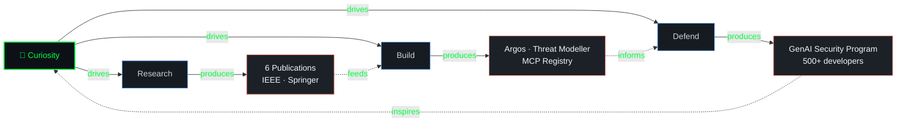

<div align="center">

```
   ███████╗██╗    ██╗ █████╗ ███████╗████████╗██╗██╗  ██╗
   ██╔════╝██║    ██║██╔══██╗██╔════╝╚══██╔══╝██║██║ ██╔╝
   ███████╗██║ █╗ ██║███████║███████╗   ██║   ██║█████╔╝ 
   ╚════██║██║███╗██║██╔══██║╚════██║   ██║   ██║██╔═██╗ 
   ███████║╚███╔███╔╝██║  ██║███████║   ██║   ██║██║  ██╗
   ╚══════╝ ╚══╝╚══╝ ╚═╝  ╚═╝╚══════╝   ╚═╝   ╚═╝╚═╝  ╚═╝
                                                          
        [ A I   S E C U R I T Y   B U I L D E R ]
```

```diff
- root@swastik:~# whoami
+ Senior Product Security Engineer @ IKEA · GenAI Security Architect
! Building defenses for the systems that build everything else.
```

[](https://git.io/typing-svg)

</div>

---

## ` ./scan --target=swastik --depth=full `

```yaml
identity:
  handle:        swastik-mukherjee
  role:          Senior Product Security Engineer
  org:           IKEA (Ingka Group)
  location:      Bangalore, IN  ::  18.5 lat, 73.8 long
  experience:    7+ years
  domain:        AI/ML Security · Product Security · DevSecOps

mission:
  > "To make secure the default state — not the afterthought —
     for every system that learns, infers, or decides."

current_focus:
  - Hardening enterprise GenAI & MCP Registry architectures
  - Adversarial testing of LLM systems (prompt injection, data exfil, model abuse)
  - Building AI-powered security tooling that out-thinks the threats
```

---

## ` ./capabilities --list --grouped `

<table>
<tr>
<td valign="top" width="50%">

### 🧠 `AI/ML Security Stack`
```
▓▓▓▓▓▓▓▓▓▓  LLM Security Controls
▓▓▓▓▓▓▓▓▓▓  Prompt Injection Defense
▓▓▓▓▓▓▓▓▓▓  RAG Architecture Hardening
▓▓▓▓▓▓▓▓▓▓  MCP Protocol Security
▓▓▓▓▓▓▓▓▓▓  AI Supply Chain Risk
▓▓▓▓▓▓▓▓▓▓  OWASP LLM Top 10
▓▓▓▓▓▓▓▓▓▓  MITRE ATLAS · MAESTRO
▓▓▓▓▓▓▓▓▓▓  Adversarial GenAI Testing
```

### ☁️ `Cloud & Container Security`
```
▓▓▓▓▓▓▓▓▓░  Azure  ·  GCP  ·  AWS
▓▓▓▓▓▓▓▓▓░  Kubernetes · Docker
▓▓▓▓▓▓▓▓▓░  Trivy · kube-bench · Twistlock
▓▓▓▓▓▓▓▓▓▓  Terraform · TFSec · Ansible
```

</td>
<td valign="top" width="50%">

### 🛡️ `SSDLC & Shift-Left Arsenal`
```
▓▓▓▓▓▓▓▓▓▓  CodeQL · SonarQube · Blackduck
▓▓▓▓▓▓▓▓▓▓  Dependabot · GHAS
▓▓▓▓▓▓▓▓▓▓  Nuclei · OWASP ZAP
▓▓▓▓▓▓▓▓▓▓  Talisman · Secret Scanning
▓▓▓▓▓▓▓▓▓▓  STRIDE · MITRE ATT&CK
▓▓▓▓▓▓▓▓▓▓  Zero Trust Architecture
▓▓▓▓▓▓▓▓▓▓  Policy-as-Code
```

### ⚙️ `Automation & Pipelines`
```
▓▓▓▓▓▓▓▓▓▓  GitHub Actions · Jenkins · Bamboo
▓▓▓▓▓▓▓▓▓▓  Python · Shell · PowerShell
▓▓▓▓▓▓▓▓▓░  Backstage · Platform Engineering
▓▓▓▓▓▓▓▓▓▓  RAG Pipelines · LangChain
```

</td>
</tr>
</table>

---

## ` ./flagship-builds --show=highlights `

<table>
<tr>
<td width="50%" valign="top">

### 🎯 `ARGOS`
**Enterprise Proactive SSDLC Automation Platform**
> Architect & Product Owner

One-click security enablement · On-demand assessments · Maturity scoring · Auto-secure templates baked into the developer's paved road.

`Platform Engineering` · `Backstage` · `Python`

</td>
<td width="50%" valign="top">

### 🤖 `THREAT-MODELLING ASSISTANT`
**LLM-Powered Architecture Security Reviewer**
> Built MVP from zero

RAG + MAESTRO framework automating risk-context gathering across 40+ system architectures. Targeting **60% cycle-time reduction** and **40 hrs/month** of engineering capacity recovered.

`RAG` · `MAESTRO` · `LLM` · `Python`

</td>
</tr>
<tr>
<td width="50%" valign="top">

### 🔌 `SECURE MCP REGISTRY`
**GenAI Tool Orchestration, Locked Down**
> Co-architect with Backstage team

Defining governance, access controls, and threat models for enterprise-wide MCP adoption — before MCP became the conversation everyone was having.

`MCP Protocol` · `Container Security` · `Backstage`

</td>
<td width="50%" valign="top">

### 👁️ `UNIFIED SECURITY VISIBILITY`
**One Pane. Every Finding. Zero Noise.**
> Pivotal contributor

Centralized, deduplicated, and distilled findings from every security tool into a single actionable signal — turning routine triage into strategic decision-making.

`SAST` · `SCA` · `Container` · `Cloud`

</td>
</tr>
</table>

---

## ` ./impact --metrics `

<div align="center">

| `Metric` | `Value` | `Context` |
|:--|:--|:--|
| 👨‍💻 Developers Onboarded to GenAI Guardrails | **500+** | OWASP LLM Top 10-aligned program |
| 🏗️ System Architectures Secured | **40+** | AI threat modeling assistant |
| 🚀 CI/CD Pipelines Hardened | **200+** | Shift-left automation |
| ☁️ Azure Resources Orchestrated | **1,500+** | IaC + security baselines |
| 🛠️ Build Agents Managed | **300+** | Hybrid Linux/Windows |
| 🔻 Open-Source Release Cycle Time | **−80%** | Automated OSS readiness pipeline |
| 🔻 Infrastructure Vulnerabilities | **−30%** | Secure IaC modules |
| 📚 Peer-Reviewed Publications | **6** | IEEE · Springer · IOS · IGI |

</div>

---

## ` ./threat-model --self `



---

## ` ./achievements --decode `

```diff
+ [2024] 🥇 IKEA Data Hero — Gold Medalist (Inter-IKEA Hackathon)
+ [2024] 🥈 Inner-Source Hackathon Runner-Up
+ [2024] 🎬 IKEA Hub Ambassador — Featured in global employer branding
+ [2023] 🏆 Best DevSecOps Leader of the Year (Quantic Business Media)
+ [2019] 🎓 M.Tech, Jadavpur University — CGPA 8.67
+ [2017] 🎓 B.Tech CSE, MAKAUT — CGPA 8.26
```

**Certifications**: `Azure AZ-900` · `Azure AZ-104` · `GCP Associate Cloud Engineer` · `GitHub Foundations` · `SAFe Scrum Master 5.1`

---

## ` ./philosophy --print `

> ```
> Security is not a checkpoint.
> It is the gradient along which good systems are built.
>
> The next attack surface isn't a port —
> it's a prompt.
>
> So I build for the world where the model is the perimeter.
> ```

---

## ` ./connect --secure `

<div align="center">

[](https://swastikmukherjee.com)
[](https://linkedin.com/in/swastik-mukherjee)
[](mailto:swastik.reach@gmail.com)

```bash
$ ssh swastik@thefuture --topic="ai-security"
[+] Handshake established. Let's build the defenses 
    that make GenAI worthy of the trust it asks for.
```


</div>

<!-- 
  Built with intent. No copy-paste templates.
  Threat model: a recruiter, a peer, or a future collaborator scanning this profile.
  Mitigation: signal who I am, what I build, and why it matters — in under 60 seconds.
-->
